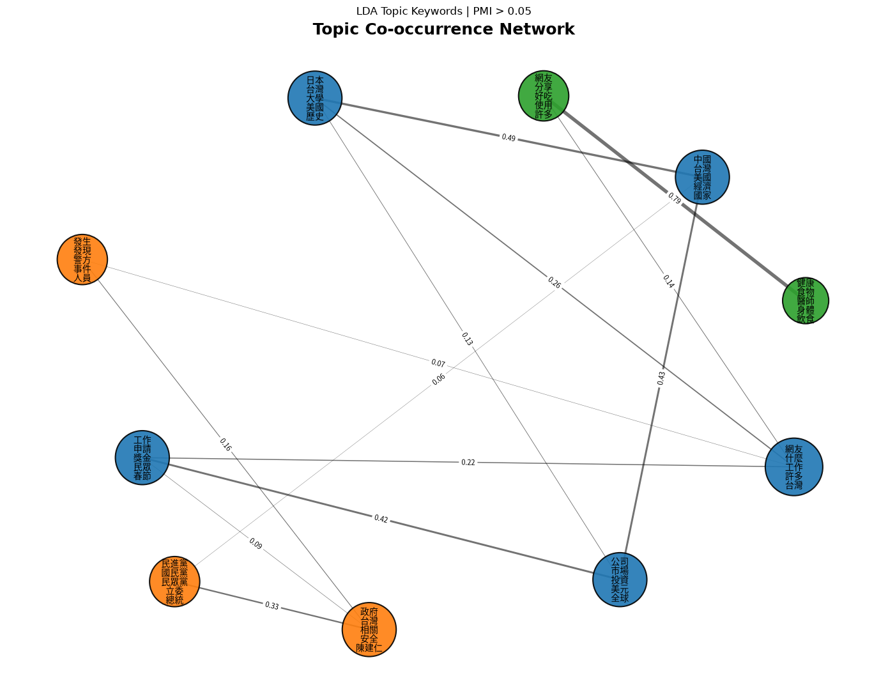
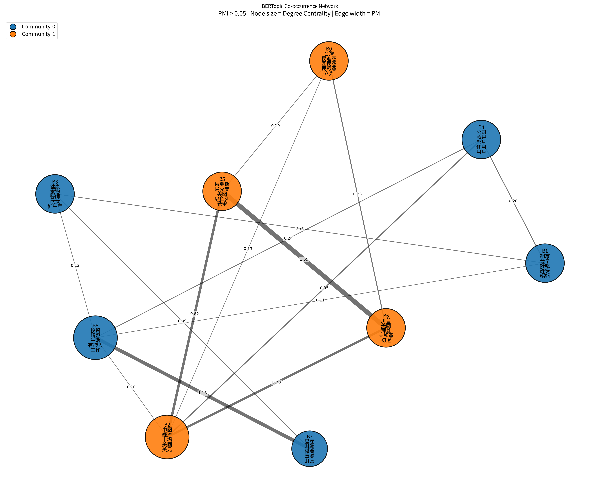
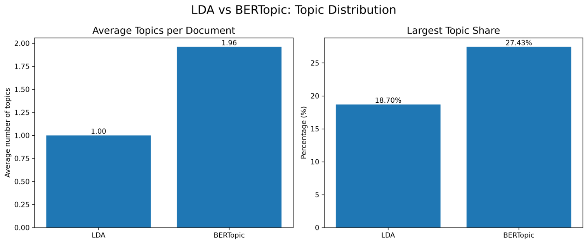

# Chinese News Topic Modeling: LDA vs. BERTopic

A comparative topic modeling study of Chinese news articles using
Latent Dirichlet Allocation (LDA) and BERTopic, with additional
topic co-occurrence network and community analysis.

---

## Overview

This project investigates how different topic modeling approaches
identify and organize thematic structures in Chinese news articles.

Two topic modeling approaches are compared:

- **Latent Dirichlet Allocation (LDA)**
- **BERTopic**

In addition to topic extraction, the project constructs topic
co-occurrence networks based on Pointwise Mutual Information (PMI)
and applies community detection to identify higher-level thematic
structures.

The main goal is to examine how probabilistic topic modeling and
embedding-based topic modeling differ in:

- topic structure
- topic distribution
- topic coherence and interpretability
- topic relationships
- higher-level thematic communities

---

## Dataset

The dataset contains:

- **5,764 Chinese news documents**
- Chinese news articles collected from multiple content categories
- Preprocessed and segmented Chinese text

The analysis focuses on the thematic structure of the articles
rather than document-level classification.

---

## Methodology

### 1. Text Preprocessing

The preprocessing pipeline includes:

- Chinese word segmentation
- punctuation removal
- stopword removal
- number filtering
- removal of unwanted tokens
- construction of document-term representations

---

### 2. LDA Topic Modeling

Latent Dirichlet Allocation was used as a probabilistic baseline.

The final model contains:

- **10 topics**
- one dominant topic assigned to each document
- topic-level keyword extraction
- document distribution analysis
- topic purity analysis

Topic purity was calculated by examining the proportion of documents
within each topic that belong to its dominant original content tag.

---

### 3. BERTopic

BERTopic was used as an embedding-based topic modeling approach.

The workflow includes:

1. Sentence-transformer embeddings
2. UMAP dimensionality reduction
3. HDBSCAN clustering
4. BERTopic topic representation
5. Topic reduction
6. Multi-topic document assignment

The final BERTopic model contains:

- **9 topics**
- an average of approximately **1.96 topics per document**

Unlike LDA, BERTopic allows documents to be associated with
multiple topics.

---

### 4. Topic Co-occurrence Networks

Topic relationships were analyzed using topic co-occurrence
networks.

For each document, topics appearing together were treated as
co-occurring topic pairs.

Pointwise Mutual Information (PMI) was used to measure the strength
of association between topics:

$$
PMI(x,y) = \log \frac{P(x,y)}{P(x)P(y)}
$$

Only edges with:

\[
PMI > 0.05
\]

were retained for the final networks.

---

### 5. Community Detection

Greedy modularity-based community detection was applied to the
topic networks.

This allows individual topics to be grouped into broader
semantic communities.

---

## Results

### Overall Comparison

| Metric | LDA | BERTopic |
|---|---:|---:|
| Number of topics | 10 | 9 |
| Documents | 5,764 | 5,764 |
| Average topics per document | 1.00 | 1.96 |
| PMI > 0.05 edges | 7 | 15 |
| Number of communities | 3 | 2 |
| Largest community | 5 topics | 5 topics |
| Largest topic share | 18.70% | 27.43% |
| Average topic purity | 69.03% | N/A |

---

## LDA Topic Structure

The LDA model identified ten topics covering several broad
semantic areas, including:

- lifestyle and food
- health
- Taiwanese politics
- public affairs
- international affairs
- travel
- personal finance
- technology and business

The LDA topic network contained **7 edges** after applying the
PMI > 0.05 threshold and was divided into **3 communities**.

---

## BERTopic Topic Structure

BERTopic identified nine topics with relatively distinct semantic
representations.

The main topics included:

- Taiwanese politics
- lifestyle and food
- international economy
- health
- technology
- international conflicts
- US politics
- astrology and fortune
- personal finance

The BERTopic network contained **15 edges** after PMI filtering
and formed **2 major communities**.

---

## Community Interpretation

### LDA

The three major LDA communities can be interpreted as:

1. **Lifestyle, Economy & International Affairs**
2. **Politics, Government & Public Affairs**
3. **Lifestyle, Food & Health**

### BERTopic

The two BERTopic communities can be interpreted as:

1. **Lifestyle, Health, Technology & Personal Finance**
2. **Politics, Economy & International Affairs**

These results suggest that the two models identify similar
high-level semantic domains but organize individual topics
differently.

---

## Visualizations

### LDA Topic Network

The LDA network shows topic relationships based on PMI.



### BERTopic Topic Network

The BERTopic network shows stronger and denser topic
co-occurrence relationships.



### LDA vs. BERTopic

The final comparison visualizes the differences in topic
distribution between the two models.



---

## Key Findings

The main findings of the study are:

1. **Both models identify similar high-level thematic domains.**
   Politics, international affairs, lifestyle, health, and
   economic topics appear in both models.

2. **BERTopic produces a more interconnected topic structure.**
   Its network contains 15 PMI-filtered edges compared with 7
   for LDA.

3. **BERTopic supports multi-topic document representation.**
   Documents are associated with an average of 1.96 topics,
   compared with one dominant topic per document in LDA.

4. **LDA provides relatively high topic purity.**
   The average topic purity of the LDA topics is 69.03%.

5. **The two models organize semantic space differently.**
   LDA produces three communities, whereas BERTopic produces
   two broader communities.

Overall, LDA provides a relatively interpretable probabilistic
baseline, while BERTopic captures richer topic interactions and
allows documents to participate in multiple semantic topics.

---

## Project Structure

```text
.
├── notebooks/
│   ├── 01_data_collection.ipynb
│   └── 02_LDA_topic_analysis.ipynb
│   └── 03_bert_opic_analysis.ipynb
│
├── data/
│   └── README.md
│
├── figures/
│   ├── LDA_network_PMI005.png
│   ├── BERTopic_network_PMI005.png
│   └── final_topic_comparison.png
│
├── results/
│   ├── lda_topic_keywords.json
│   ├── lda_dominant_topic.csv
│   └── documents_for_bertopic.csv
│
├── report/
│   └── report.pdf
│
├── requirements.txt
└── README.md
